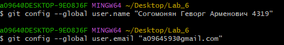
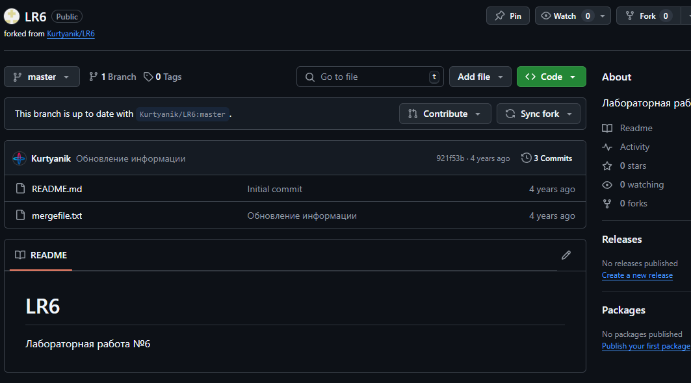
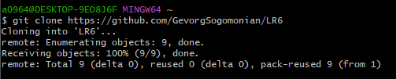

# LR6
Лабораторная работа №6

### Согомонян Г. А.  Группа № 4319

---

## 1. Создание аккаунта на GitHub

- Аккаунт успешно создан на [GitHub](https://github.com/GevorgSogomonian).
- А также успешно привязан в Git Bash и новый файл через интерфейс GitHub.

## 2. Копирование репозитория (Fork)

- Оригинальный репозиторий находится по адресу: https://github.com/Kurtyanik/LR6/.
- Репозиторий скопирован в личное хранилище с помощью кнопки **Fork**.

## 3. Установка Git

- Git установлен с официального сайта.

## 4. Клонирование репозитория и пулл изменений

